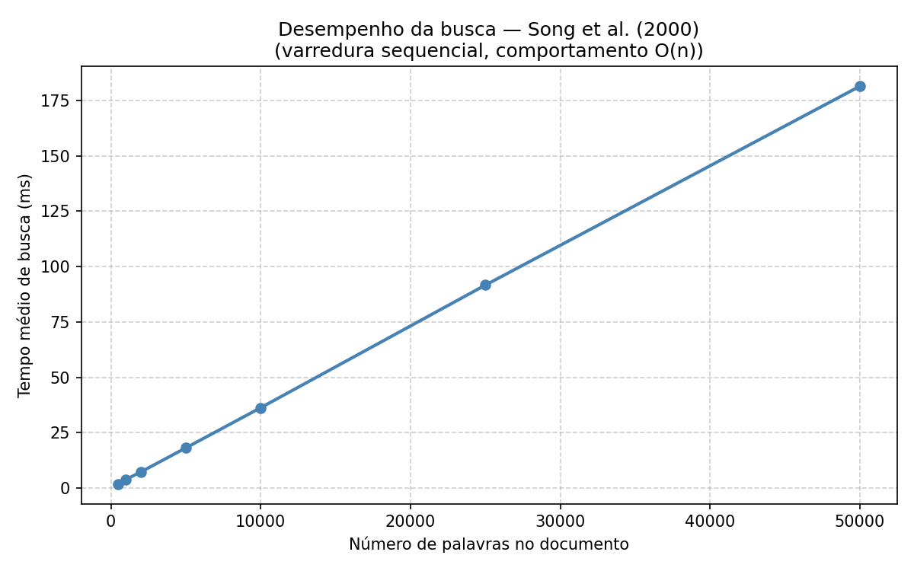
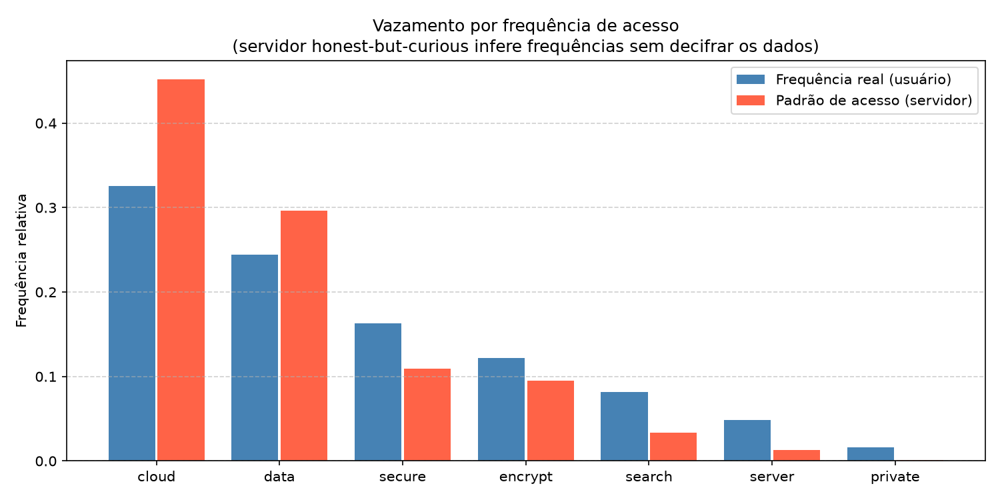

# Progresso do trabalho - Searchable Encryption

INE5429 - Segurança em Computação  
Artur Luiz Rizzato Toru Soda, Davi Menegaz Junkes, Matheus Fernandes Bigolin

---

Esse documento resume o que foi feito até agora no trabalho. A ideia é que todo mundo do grupo leia, entenda o que foi implementado e o que cada parte faz, e aí a gente decide juntos se está bom para partir pro relatório final.

## O que foi feito até agora

O código está todo implementado e funcionando. Temos três arquivos em `src/`:

- `sse.py` — implementação dos 5 algoritmos do esquema
- `demo.py` — exemplo concreto rodando os algoritmos passo a passo
- `experiments.py` — três experimentos com resultados e gráficos

Para rodar tudo:

```bash
pip install -r requirements.txt
python src/demo.py
python src/experiments.py
```

---

## O problema que o trabalho resolve

Antes de entrar no código, vale lembrar o problema que a gente está resolvendo, porque ele é o coração do trabalho.

Imagina que você tem documentos com informações sensíveis e quer guardar tudo na nuvem. A solução óbvia pra proteger a privacidade é cifrar os documentos antes de mandar pro servidor. Mas aí surge um problema: quando você precisar buscar alguma coisa nesses documentos, como faz? Baixar tudo, decifrar localmente e então buscar não faz sentido, porque anula a vantagem de usar um servidor externo.

Searchable Encryption resolve esse problema: o servidor consegue buscar palavras nos dados cifrados sem precisar decifrá-los, e sem aprender qual palavra você buscou.

O algoritmo que implementamos é o de Song, Wagner e Perrig (2000), que foi o primeiro esquema com esse objetivo a ter provas formais de segurança. A ideia central é cifrar cada palavra do documento com uma estrutura matemática especial embutida no ciphertext. Essa estrutura permite que o servidor verifique se uma palavra está presente, sem aprender o que a palavra é.

---

## Como o algoritmo funciona

O esquema tem cinco operações. Para cada uma, explicamos o que ela faz e como ela faz.

**KeyGen**

Gera as três chaves secretas que ficam com o usuário. Como faz: chama `os.urandom(16)` três vezes, que produz 16 bytes criptograficamente aleatórios para cada chave. Nenhuma das três tem relação com as outras. As chaves nunca saem do lado do usuário.

- `k_seed`: semente do gerador pseudo-aleatório que vai produzir os valores `S_i`
- `k'`: chave usada internamente para derivar uma chave diferente para cada posição do documento
- `k''`: chave da cifra simétrica que pré-cifra as palavras antes de tudo

**Encrypt**

Cifra o documento palavra por palavra e manda os blocos resultantes pro servidor. Como faz, para cada palavra `W_i`:

1. Aplica AES com a chave `k''` na palavra: `X_i = E(k'', W_i)`. Isso transforma a palavra em 16 bytes que parecem aleatórios. É uma cifra determinística: a mesma palavra sempre produz o mesmo `X_i`.

2. Divide `X_i` ao meio: `L_i` (primeiros 8 bytes) e `R_i` (últimos 8 bytes). O `L_i` vai ser usado pra derivar a chave do bloco.

3. Gera um valor pseudo-aleatório `S_i` a partir de `k_seed` usando AES em modo CTR como gerador. Cada posição `i` do documento recebe um `S_i` diferente. Esse valor é o que garante que a mesma palavra em posições diferentes produce ciphertexts distintos.

4. Calcula `k_i = f(k', L_i)` via HMAC-SHA256. Isso cria uma chave específica pro bloco `i`, derivada do conteúdo cifrado da palavra naquela posição.

5. Calcula `P_i = F(k_i, S_i)` via HMAC-SHA256. Esse é o valor de verificação: um "carimbo" de que `S_i` foi processado com a chave correta do bloco.

6. Monta `T_i = S_i || P_i` (concatenação dos dois) e calcula `C_i = X_i XOR T_i`. O XOR mascara `X_i` com `T_i`, que tem a estrutura especial `(S_i, F(k_i, S_i))` embutida.

O `C_i` resultante é o que vai pro servidor. Parece completamente aleatório.

**Trapdoor**

Gera o token de busca para uma palavra `W` sem revelar a palavra. Como faz: aplica exatamente as mesmas operações do início do Encrypt na palavra buscada, `X = E(k'', W)` e `k = f(k', X[:8])`, mas sem gerar `S_i` nem montar ciphertext. O par `(X, k)` é enviado ao servidor. Com `X`, o servidor consegue cancelar a pré-cifra nos blocos que casam. Com `k`, ele consegue verificar se o resultado tem a estrutura certa. Mas sem `k''`, não tem como recuperar `W` a partir de `X`, porque reverter AES sem a chave é computacionalmente inviável.

**Search**

É executado pelo servidor. Para cada bloco `C_i` do ciphertext, o servidor calcula `V = C_i XOR X` e verifica se os últimos 8 bytes de `V` são iguais a `F(k, V[:8])`.

Por que isso funciona: se a palavra na posição `i` for igual à palavra buscada (`W_i == W`), então `X_i = E(k'', W_i) = E(k'', W) = X`. Aí o XOR cancela: `C_i XOR X = (X_i XOR T_i) XOR X = T_i = S_i || P_i`. O servidor então verifica se `F(k, S_i) == P_i`, o que é verdade porque `k = k_i` quando `W_i == W`. Se a palavra for diferente, o XOR não cancela e `V` vira lixo pseudo-aleatório. A verificação falha com probabilidade `1 - 1/2^64`, ou seja, quase certamente.

O servidor nunca precisa saber `W` pra fazer essa verificação. Só precisa de `(X, k)`.

**Decrypt**

Desfaz a cifragem e recupera o documento original. Como faz: regenera os mesmos valores `S_i` a partir de `k_seed` (o PRG é determinístico, então os valores são idênticos). Com `S_i` em mãos, recupera `L_i = C_i[:8] XOR S_i`, depois recalcula `k_i = f(k', L_i)` e `P_i = F(k_i, S_i)`, e então `R_i = C_i[8:] XOR P_i`. Juntando `L_i || R_i` forma `X_i`, e aplicando AES inverso com `k''` recupera `W_i = E^{-1}(k'', X_i)`. O processo é o inverso exato do Encrypt.

---

## Implementação (`sse.py`)

As primitivas usadas são:

| Operação | Primitiva | Biblioteca |
|---|---|---|
| E (cifra determinística) | AES-128 ECB | cryptography |
| f (derivar k_i) | HMAC-SHA256 truncado para 16 bytes | cryptography |
| F (verificação) | HMAC-SHA256 truncado para 8 bytes | cryptography |
| G (gerador S_i) | AES-128 CTR com IV zero | cryptography |

Usamos AES-ECB pra `E` porque precisa ser determinístico: a mesma palavra sempre produz o mesmo `X_i`, independente da posição. Isso é necessário pra que o trapdoor funcione em qualquer posição do documento.

O tamanho do bloco é `n = 128 bits` (16 bytes), com `m = 64 bits` para verificação. A taxa de falso positivo é `1/2^64` por posição, o que é desprezível na prática.

O código completo está em `src/sse.py`. Abaixo as assinaturas das funções:

```python
def keygen() -> tuple[bytes, bytes, bytes]
def encrypt(K, document: list[str]) -> list[bytes]
def trapdoor(K, word: str) -> tuple[bytes, bytes]
def search(C: list[bytes], trap: tuple[bytes, bytes]) -> list[int]
def decrypt(K, C: list[bytes]) -> list[str]
```

---

## Mini-exemplo (`demo.py`)

Rodamos o esquema no documento `["the", "cat", "sat", "on", "the", "mat"]` e mostramos cada valor intermediário. Abaixo está o output completo de uma execução:

```
==============================================================
Mini-exemplo - Searchable Encryption (Song et al., 2000)
==============================================================

Documento de entrada: ['the', 'cat', 'sat', 'on', 'the', 'mat']
Parametros: n=128 bits, m=64 bits, L=64 bits

==============================================================
KeyGen
==============================================================
  k_seed  (PRG)  = ebcaa1a50d8dda82 5592931d32ecf516
  k'      (f)    = 6dfc6551bc6c8548 fb141965eaccfd3e
  k''     (E)    = f638607a7f6d3df6 e12c3454d442f149

==============================================================
Encrypt - passo a passo para "cat" (posicao 1)
==============================================================
  W_1  (plaintext, com padding)  = 6361740000000000 0000000000000000
       ("cat" + 13 bytes \x00)

  X_1  = E(k'', W_1)            = c72fe676b0f5cca5 47bc601746ac02d5
  L_1  = X_1[:8]                = c72fe676b0f5cca5
  R_1  = X_1[8:]                = 47bc601746ac02d5

  S_1  = G(k_seed)[1]           = 4a854df46c69f653
  k_1  = f(k', L_1)             = 87b25aa5b62cec8a 596fc66d885c5786
  P_1  = F(k_1, S_1)            = 9a3adc38b890a198
  T_1  = S_1 || P_1             = 4a854df46c69f653 9a3adc38b890a198

  C_1  = X_1 XOR T_1            = 8daaab82dc9c3af6 dd86bc2ffe3ca34d

==============================================================
Encrypt - todos os blocos
==============================================================
  C[0]  "the"  ->  eb6de9d830b6a889 59f9b4b52d90b86a
  C[1]  "cat"  ->  8daaab82dc9c3af6 dd86bc2ffe3ca34d
  C[2]  "sat"  ->  b1915b9b29933112 fe2a8562327f331d
  C[3]  "on"   ->  11a16a04a238abb0 23bfc06d267c9b6b
  C[4]  "the"  ->  170b562afc654a00 881511d34d313758
  C[5]  "mat"  ->  ff74fda8fddf9d85 ff09a6f626a3c531

==============================================================
Trapdoor para "cat"
==============================================================
  X  = c72fe676b0f5cca5 47bc601746ac02d5
  k  = 87b25aa5b62cec8a 596fc66d885c5786
  Token enviado ao servidor: (X, k)

==============================================================
Search
==============================================================
  Busca "cat"  ->  posicoes [1]    (esperado [1])    [OK]
  Busca "the"  ->  posicoes [0, 4] (esperado [0, 4]) [OK]
  Busca "sat"  ->  posicoes [2]    (esperado [2])    [OK]
  Busca "dog"  ->  posicoes []     (esperado [])     [OK]

==============================================================
Decrypt
==============================================================
  posicao 0: "the"  [OK]
  posicao 1: "cat"  [OK]
  posicao 2: "sat"  [OK]
  posicao 3: "on"   [OK]
  posicao 4: "the"  [OK]
  posicao 5: "mat"  [OK]

==============================================================
Sigilo provavel: "the" aparece nas posicoes 0 e 4
==============================================================
  C[0]  = eb6de9d830b6a889 59f9b4b52d90b86a
  C[4]  = 170b562afc654a00 881511d34d313758

  Os dois ciphertexts sao iguais? False

  Mesmo que a palavra seja identica, cada posicao recebe um valor
  S_i diferente gerado pelo PRG. O resultado e que o servidor ve
  dois blocos completamente distintos e nao tem como saber que
  ambos correspondem a mesma palavra.

==============================================================
Consulta oculta: o que o servidor recebe ao buscar "cat"
==============================================================
  X  = c72fe676b0f5cca5 47bc601746ac02d5
  k  = 87b25aa5b62cec8a 596fc66d885c5786

  O servidor recebe apenas esses dois valores. Sem a chave k''
  e impossivel recuperar "cat" a partir de X, pois X = E(k'', "cat")
  e AES sem a chave e computacionalmente inviavel de reverter.
```

Tem alguns pontos que vale destacar na saída acima para a discussão no relatório:

**A palavra "cat" em ASCII é `63 61 74`** (os primeiros 3 bytes de `W_1`). Depois vêm 13 bytes `00` de padding pra completar o bloco de 16 bytes. O valor `X_1 = E(k'', W_1)` já não tem nenhuma relação visual com "cat": é o AES com a chave `k''` aplicado ao bloco.

**O ciphertext `C_1` é o XOR de `X_1` com `T_1`**. O `T_1` é composto por `S_1` (aleatório, diferente pra cada posição) concatenado com `F(k_1, S_1)`. Essa é a estrutura especial que permite a busca: quando o servidor faz `C_i XOR X` com o trapdoor correto, o `X_i` é cancelado e aparece a estrutura `(S_i, F(k_i, S_i))`, que o servidor consegue verificar.

**A seção de sigilo provável** mostra que C[0] e C[4] são completamente diferentes, mesmo ambos sendo ciphertexts de "the". Isso é garantido pelos valores `S_0` e `S_4` que são diferentes, então o XOR final produz resultados distintos.

---

## Experimentos (`experiments.py`)

### Experimento 1 - Corretude

**O que é:** verificação de que os algoritmos implementados estão corretos em diferentes situações de uso.

**Como funciona:** criamos um documento de 300 palavras escolhidas aleatoriamente de um vocabulário fixo, e inserimos a palavra "target" manualmente nas posições 42, 150 e 275. Depois ciframos o documento e rodamos cinco buscas diferentes, cada uma testando um aspecto do esquema:

- Busca por "target": esperamos receber exatamente as posições [42, 150, 275]
- Busca por "qwerty" (palavra que não existe): esperamos lista vazia
- Busca por "cloud" (palavra que aparece muitas vezes): esperamos todas as posições onde ela ocorre
- Decriptação completa: deciframos o ciphertext e comparamos com o documento original palavra por palavra
- Trapdoor com chave errada: geramos um segundo par de chaves `K2`, ciframos o mesmo documento com `K2`, e tentamos buscar usando um trapdoor gerado com a chave original `K`. O resultado deve ser vazio, pois sem a chave correta o trapdoor não produz matches válidos

```
Caso                                   Esperado               Obtido                 Status
--------------------------------------------------------------------------------------------
"target" (existe, 3 ocorrencias)       [42, 150, 275]         [42, 150, 275]         OK
"qwerty" (nao existe)                  []                     []                     OK
"cloud" (multiplas ocorrencias)        [1, 2, 9, 13, 16]...   [1, 2, 9, 13, 16]...   OK
Decriptacao completa (300 palavras)    igual ao original      igual ao original      OK
Chave errada (isolamento de consulta)  []                     []                     OK
```

Todos os cinco casos passaram. O quinto caso em particular confirma uma propriedade de segurança importante: sem as chaves corretas, não é possível fazer buscas válidas no ciphertext, nem mesmo tendo acesso ao próprio ciphertext.

### Experimento 2 - Desempenho

**O que é:** verificação empírica de que o tempo de busca cresce linearmente com o tamanho do documento, conforme previsto pela análise de complexidade O(n) do paper.

**Como funciona:** geramos documentos com tamanhos variando de 500 a 50.000 palavras, ciframos cada um e medimos o tempo médio de 5 execuções do algoritmo de busca. Buscamos sempre por uma palavra que não existe no documento, o que força o algoritmo a varrer o documento inteiro sem sair no meio. Isso garante que medimos o custo real de uma busca completa, não de uma busca que encontrou o resultado cedo.

```
n =    500 palavras  ->   1.8 ms por busca
n =   1000 palavras  ->   3.6 ms por busca
n =   2000 palavras  ->   7.3 ms por busca
n =   5000 palavras  ->  18.3 ms por busca
n =  10000 palavras  ->  35.8 ms por busca
n =  25000 palavras  ->  90.3 ms por busca
n =  50000 palavras  -> 180.8 ms por busca
```



O comportamento é linear: dobrar o número de palavras dobra o tempo de busca. O crescimento de 500 para 50.000 palavras (fator 100) corresponde a um crescimento de 1.8 ms para 180.8 ms (fator ~100 também). Isso confirma na prática o que o paper demonstra teoricamente.

### Experimento 3 - Vazamento por frequência de acesso

**O que é:** demonstração da principal limitação do esquema. Mesmo sem decifrar nada, um servidor que observa muitas buscas ao longo do tempo consegue inferir quais palavras são mais comuns nos documentos.

**Como funciona:** montamos um vocabulário de 7 palavras com frequências propositalmente diferentes (cloud=40, data=30, secure=20, encrypt=15, search=10, server=6, private=2). Criamos um documento onde cada palavra aparece um número de vezes proporcional a essa frequência, ciframos e simulamos 300 buscas. Cada busca é sorteada com probabilidade proporcional à frequência real das palavras, que é o comportamento esperado num uso normal (o usuário busca mais as palavras que aparecem mais).

O servidor não sabe qual palavra foi buscada em cada consulta. Ele só observa dois dados por busca: o trapdoor `(X, k)` (que parece aleatório) e a lista de posições retornadas. Contabilizamos quantas posições o servidor acumulou por palavra ao longo das 300 buscas e normalizamos pra comparar com a frequência real.

```
Palavra      Freq. real  Padrao servidor
----------------------------------------
cloud            32.5%           45.2%
data             24.4%           29.6%
secure           16.3%           10.9%
encrypt          12.2%            9.5%
search            8.1%            3.4%
server            4.9%            1.3%
private           1.6%            0.1%
```



A ordem das palavras por frequência é preservada nos dois lados: o ranking do servidor (barras vermelhas) reflete o ranking real do usuário (barras azuis). Isso acontece porque palavras mais frequentes aparecem em mais posições do documento, então toda vez que são buscadas retornam mais resultados, o que acumula mais no contador do servidor.

Esse fenômeno é chamado de vazamento por padrão de acesso (*access pattern leakage*). O paper de Song et al. (2000) já reconhece essa limitação na Seção 5.5. Foi principalmente por causa dela que a área continuou evoluindo: esquemas mais recentes, como o de Curtmola et al. (2006), usam índices cifrados que ocultam esse padrão, mas com overhead maior de armazenamento.

---

## O que falta fazer

A implementação está completa. O que ainda precisamos fazer é o relatório final, que deve:

1. Atualizar a seção de introdução (pequena adição mencionando que a implementação foi concluída)
2. Adicionar o mini-exemplo do `demo.py` na seção de desenvolvimento
3. Escrever a seção de implementação descrevendo as escolhas técnicas
4. Escrever a seção de resultados experimentais com os gráficos e análise
5. Escrever a conclusão
6. Adicionar a declaração de uso de IA nas referências

O prazo é 05/07.
